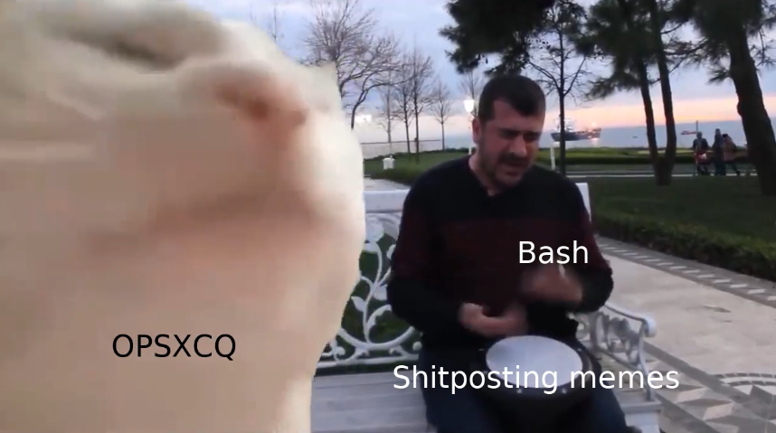

# Vibing Cat generator script



This script generates the Vibing Cat meme from a template

# Usage

```shell
./cat-vibing.sh -c OPSXCQ -d Github -x "Shit Posting"
```

# Help

```shell
  ----[ Cat Vibing meme Generator by OPSXCQ ]----
The general script's help msg
Usage: ./cat-vibing.sh [-o|--output <arg>] [-c|--cat-text <arg>] [-d|--drummer-text <arg>] [-x|--drum-text <arg>] [-v|--version] [-h|--help]
	-o, --output: output video for the meme (default: 'meme.mp4')
	-c, --cat-text: Text over the cat (default: 'OPSXCQ')
	-d, --drummer-text: Text over the drummer (default: 'Bash')
	-x, --drum-text: Text over the drum (default: 'Memes')
	-t, --time-duration: Output video duration in second. between 1 to 174s (default: '174')
	-v, --version: Prints version
	-h, --help: Prints help
```
